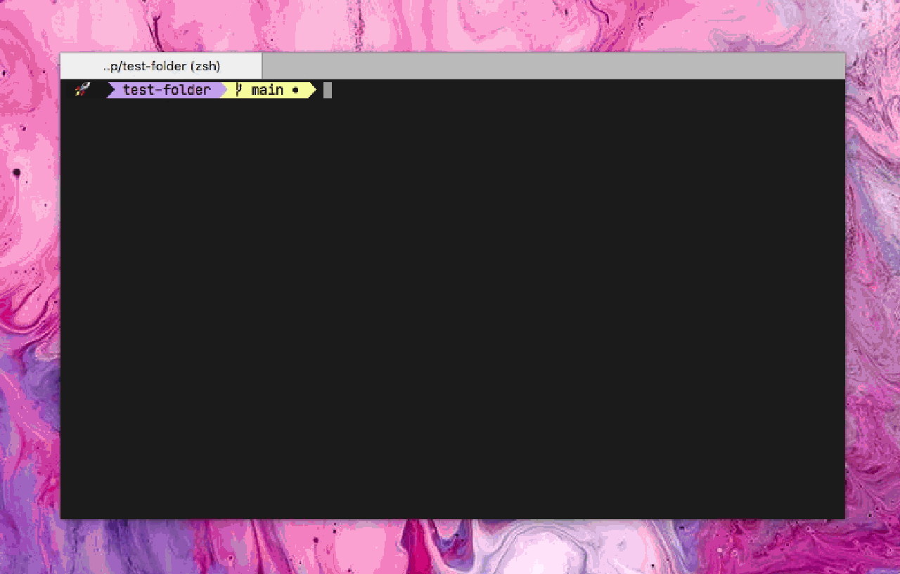

# `exp`
 

</img>

<strong> CLI to create an opinionated temporary folder structure, automatically cleanup after they're expired. </strong>

- `exp` will create temp folder `explore` and to soon-to-be-deleted folder `expire`. 
- files/folders live inside `explore` will be moved to `expire` 7 days after its last opened. 
- and then after next 7 days all files/folder will be deleted from `expire` folder. 
- The config file `.exp` will be located at `EXP_PATH` When you run `exp init` for the first time it will be created automatically. normally you don't have to edit this file. it is being used only for checking `EXP_PATH`.

## install
- `cd to-your-target-path && exp init`
- put returned string (eg. `export EXP_PATH=/your/target/path`) after setup init-path to `.bash_profile` or `.bashrc` 
- add `exp` command to your `.bashrc` or `.bash_profile`.
- `source .bash_profile` or `source .bashrc` to reload path.

## todo
- [x] add cli for setting dir.
- [x] create config file.
- [x] push noti.
- [ ] details screenshot after folder has been deleted.
- [ ] expire date configurable.
- [x] cleaning up setup folder when EXP_PATH change.
- [ ] error handling.

## Optional
- [ ] config folder based on .gitignore

inspired by [cargo-temp](https://github.com/yozhgoor/cargo-temp)